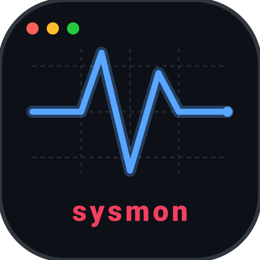

# sysmon


A Linux system monitor written in Rust - inspired by btop, built from scratch as a learning project. Designed for the terminal and tmux.

## Features
- CPU usage, temperature, frequency
- cores usages
- battery percentage and charging status
- memory (and swap) usage percentage and details

## Status

Early stage. Known Issues:
- Not handling edge-cases well

  Contributions welcome - see the [issue tab](https://github.com/MohamedGonem/sysmon/issues) for `good first issue` tasks.

## Installation

### Using Cargo
```bash
cargo install rsysmon
```

### From binary (Linux x86_64)
download from releases page
```bash
chmod +x sysmon
sudo mv sysmon /usr/local/bin/
```

### From source
```bash
git clone https://github.com/MohamedGonem/sysmon
cd sysmon
cargo build --release
sudo mv target/release/sysmon /usr/local/bin/
```

## Dependencies

- [`clap`](https://github.com/clap-rs/clap) - CLI argument parsing

## Usage
---------
```
Usage: sysmon [OPTIONS]
Options:
  -S, --sys        Show system information
  -C, --cpu        Show CPU usage (or full details with -d flag)
  -c, --cores      Show Core usage (or full details with -d flag)
  -m, --mem <MEM>  Show memory stats [possible values: memory, swap, all]
  -b, --bat        Show battery level and charging status
  -e, --env <ENV>  Output format for your terminal environment [default: normal] [possible values: tmux, normal]
  -d, --detailed   Output detailed information
  -h, --help       Print help
  -V, --version    Print version
```

## Tool in Action


## Roadmap
CPU
---
- [x] model name
- [x] vendor id
- [x] cache size
- [x] physical cores count
- [x] logical cores count
- [x] min frequency
- [x] max frequency
- [x] temperature
- [x] usage percentage
- [ ] load avg 1min
- [ ] load avg 5min
- [ ] load avg 15min
- [ ] context switches
- [ ] procs running
- [ ] boot time (btime from /proc/stat)
- [ ] per core:
   - [x] id
   - [x] usage percentage
   - [x] temperature
   - [ ] current frequency
   - [ ] governor
   - [ ] online bool
   - [x] user
   - [x] nice
   - [x] system
   - [x] idle
   - [x] iowait
   - [x] irq
   - [x] softirq
   - [x] steal
   - [x] guest
   - [x] guest_nice

MEMORY & SWAP
-------------
- [x] total ram
- [x] used ram
- [x] free ram
- [ ] available ram
- [ ] buffers
- [ ] cached
- [x] total swap
- [x] used swap
- [x] free swap

SYSTEM INFO
-----------
- [x] hostname
- [x] kernel version
- [x] uptime (raw seconds + formatted d/h/m/s)
- [x] distro name (/etc/os-release)
- [x] architecture
- [x] boot time

BATTERY
-------
- [x] status (Charging/Discharging/Full)
- [ ] capacity percent
- [ ] energy now
- [x] energy now percentage
- [ ] energy full
- [ ] energy full design
- [ ] power draw (watts)
- [ ] voltage
- [ ] cycle count
- [ ] health percent (energy_full / energy_full_design * 100)

NETWORK
-------
- [ ] per interface:
   - [ ] name
   - [ ] bytes received total
   - [ ] bytes sent total
   - [ ] download speed (delta)
   - [ ] upload speed (delta)
   - [ ] packets received
   - [ ] packets sent
   - [ ] errors in
   - [ ] errors out
   - [ ] drop in
   - [ ] drop out
   - [ ] is up (operstate)
   - [ ] mac address
   - [ ] ip address

DISK
----
- [ ] per device:
   - [ ] name
   - [ ] mount point
   - [ ] filesystem type
   - [ ] total space
   - [ ] used space
   - [ ] free space
   - [ ] usage percent
   - [ ] reads completed
   - [ ] writes completed
   - [ ] read speed (delta)
   - [ ] write speed (delta)
   - [ ] is rotational (HDD vs SSD)

PROCESSES
---------
- [ ] per process:
   - [ ] pid
   - [ ] name
   - [ ] state
   - [ ] cpu usage percent (delta)
   - [ ] memory rss
   - [ ] memory percent
   - [ ] virtual memory size
   - [ ] user/owner
   - [ ] threads count
   - [ ] open file descriptors count
   - [ ] command line
   - [ ] parent pid
   - [ ] nice value
   - [ ] start time

TEMPERATURES & FANS
-------------------
- [ ] cpu temperature (already done)
- [ ] per core temperature (already done)
- [ ] disk temperatures
- [ ] fan speeds
- [ ] fan labels

## Contributing

see [CONTRIBUTING.md](.github/CONTRIBUTING.md) for how to report bugs, suggest features, or pick up a `todo()` function.

## License
MIT
